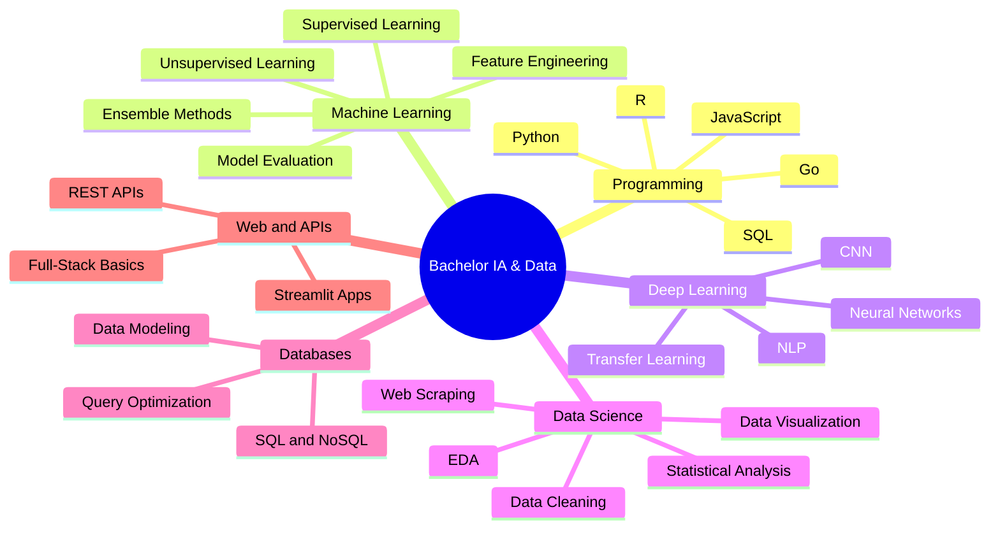

<div align="center">

<!-- 🔮  ANIMATED HEADER  🔮 -->


<!-- ⌨️  ANIMATED TYPING  ⌨️ -->

[](https://git.io/typing-svg)

<!-- 🌐  SOCIAL LINKS  🌐 -->

<p>
<a href="https://www.linkedin.com/in/louey-barbirou-2b97a828b"></a>
<a href="mailto:louey.barbirou@ynov.com"></a>
<a href="mailto:loueybarbirou12@gmail.com"></a>
<a href="https://www.instagram.com/luca__barbirou/"></a>

</p>


<br/>

<!-- Animated line -->


</div>

<!-- 🧬  ABOUT ME  🧬 -->

##  &nbsp;About Me

```js
const louey = {
    pronouns: "he" | "him",
    location: "France 🇫🇷",
    education: {
        school: "YNOV Campus",
        degree: "Bachelor IA & Data (B1 → B3)",
        graduation: 2026
    },
    currentFocus: "Machine Learning & Deep Learning",
    seeking: "Internship / Apprenticeship 🔍",
    funFact: "I believe data is like a puzzle — I won't rest until every piece fits 🧩"
};
```

<div align="center">

</div>

<!-- 🛠️  TECH STACK  🛠️ -->

##  &nbsp;Tech Stack

<div align="center">

### 🐍 Languages


### 🤖 AI / Machine Learning / Data Science

<table>
<tr>
<td align="center" width="120">
<br/>
<sub><b>Classification, Regression, Clustering</b></sub>
</td>
<td align="center" width="120">
<br/>
<sub><b>Gradient Boosting</b></sub>
</td>
<td align="center" width="120">
<br/>
<sub><b>Deep Learning</b></sub>
</td>
<td align="center" width="120">
<br/>
<sub><b>Neural Networks</b></sub>
</td>
<td align="center" width="120">
<br/>
<sub><b>Deep Learning API</b></sub>
</td>
</tr>
</table>

### 📊 Data & Visualization

<table>
<tr>
<td align="center" width="100">

</td>
<td align="center" width="100">

</td>
<td align="center" width="100">

</td>
<td align="center" width="100">

</td>
<td align="center" width="100">

</td>
<td align="center" width="100">

</td>
</tr>
</table>

### 🗄️ Databases


### 🛠️ Tools & Platforms


<table>
<tr>
<td align="center" width="100">

</td>
<td align="center" width="100">

</td>
<td align="center" width="100">

</td>
<td align="center" width="100">

</td>
</tr>
</table>

</div>

<div align="center">

</div>

<!-- 🎓  ACADEMIC SKILLS MAP  🎓 -->

##  &nbsp;What I Learned at YNOV (3 Years)

<div align="center">



</div>

<div align="center">

</div>

<!-- 🚀  FEATURED PROJECTS  🚀 -->

##  &nbsp;Featured Projects

<div align="center">

<a href="https://github.com/lucabarb/heart_attack_Prediction">

</a>
&nbsp;
<a href="https://github.com/lucabarb/student_depression">

</a>

<a href="https://github.com/lucabarb/Data-Analysis-Obesity-Levels-Lifestyle-Habits">

</a>
&nbsp;
<a href="https://github.com/lucabarb/portfolio">

</a>

</div>

<div align="center">

</div>

<!-- 📊  GITHUB STATS  📊 -->

##  &nbsp;GitHub Analytics

<div align="center">


<br/><br/>


</div>

<br/>

<!-- Activity Graph -->
<div align="center">

</div>

<div align="center">

</div>

<!-- 🏆  TROPHIES  🏆 -->

## 🏆 GitHub Trophies

<div align="center">

</div>

<div align="center">

</div>

<!-- 🐍  CONTRIBUTION SNAKE  🐍 -->

## 🐍 Watch my contributions get eaten!

<div align="center">
<picture>
  <source media="(prefers-color-scheme: dark)" srcset="https://raw.githubusercontent.com/lucabarb/lucabarb/output/github-snake-dark.svg" />
  <source media="(prefers-color-scheme: light)" srcset="https://raw.githubusercontent.com/lucabarb/lucabarb/output/github-snake.svg" />
  
</picture>
</div>

<div align="center">

</div>

<!-- 📬  CONTACT  📬 -->

##  &nbsp;Let's Connect

<div align="center">

<a href="https://www.linkedin.com/in/louey-barbirou-2b97a828b"></a>
<a href="mailto:louey.barbirou@ynov.com"></a>
<a href="mailto:loueybarbirou12@gmail.com"></a>
<a href="https://www.instagram.com/luca__barbirou/"></a>


<br/><br/>

### 💬 *"Data is the new oil, but only if you know how to refine it."* ⛽🔥

<br/>


</div>
